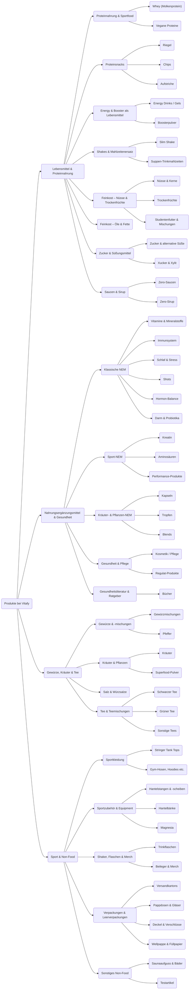

# vitafy-product-tree

```mermaid
graph LR
    A("Produkte bei Vitafy")

    %% Oberkategorien
    A --> L1("Lebensmittel & Proteinnahrung")
    A --> N1("Nahrungsergänzungsmittel & Gesundheit")
    A --> G1("Gewürze, Kräuter & Tee")
    A --> S1("Sport & Non-Food")

    %% Lebensmittel & Proteinnahrung
    L1 --> L1a("Proteinnahrung & Sportfood")
    L1a --> L1a1("Whey (Molkenprotein)")
    L1a --> L1a2("Vegane Proteine")

    L1 --> L1b("Proteinsnacks")
    L1b --> L1b1("Riegel")
    L1b --> L1b2("Chips")
    L1b --> L1b3("Aufstriche")

    L1 --> L1c("Energy & Booster als Lebensmittel")
    L1c --> L1c1("Energy Drinks / Gels")
    L1c --> L1c2("Boosterpulver")

    L1 --> L1d("Shakes & Mahlzeitenersatz")
    L1d --> L1d1("Slim Shake")
    L1d --> L1d2("Suppen-Trinkmahlzeiten")

    L1 --> L1e("Feinkost – Nüsse & Trockenfrüchte")
    L1e --> L1e1("Nüsse & Kerne")
    L1e --> L1e2("Trockenfrüchte")
    L1e --> L1e3("Studentenfutter & Mischungen")

    L1 --> L1f("Feinkost – Öle & Fette")

    L1 --> L1g("Zucker & Süßungsmittel")
    L1g --> L1g1("Zucker & alternative Süße")
    L1g --> L1g2("Xucker & Xylit")

    L1 --> L1h("Saucen & Sirup")
    L1h --> L1h1("Zero-Saucen")
    L1h --> L1h2("Zero-Sirup")

    %% Nahrungsergänzungsmittel & Gesundheit
    N1 --> N1a("Klassische NEM")
    N1a --> N1a1("Vitamine & Mineralstoffe")
    N1a --> N1a2("Immunsystem")
    N1a --> N1a3("Schlaf & Stress")
    N1a --> N1a4("Shots")
    N1a --> N1a5("Hormon-Balance")
    N1a --> N1a6("Darm & Probiotika")

    N1 --> N1b("Sport-NEM")
    N1b --> N1b1("Kreatin")
    N1b --> N1b2("Aminosäuren")
    N1b --> N1b3("Performance-Produkte")

    N1 --> N1c("Kräuter- & Pflanzen-NEM")
    N1c --> N1c1("Kapseln")
    N1c --> N1c2("Tropfen")
    N1c --> N1c3("Blends")

    N1 --> N1d("Gesundheit & Pflege")
    N1d --> N1d1("Kosmetik / Pflege")
    N1d --> N1d2("Regulat-Produkte")

    N1 --> N1e("Gesundheitsliteratur & Ratgeber")
    N1e --> N1e1("Bücher")

    %% Gewürze, Kräuter & Tee
    G1 --> G1a("Gewürze & -mischungen")
    G1a --> G1a1("Gewürzmischungen")
    G1a --> G1a2("Pfeffer")

    G1 --> G1b("Kräuter & Pflanzen")
    G1b --> G1b1("Kräuter")
    G1b --> G1b2("Superfood-Pulver")

    G1 --> G1c("Salz & Würzsalze")

    G1 --> G1d("Tee & Teemischungen")
    G1d --> G1d1("Schwarzer Tee")
    G1d --> G1d2("Grüner Tee")
    G1d --> G1d3("Sonstige Tees")

    %% Sport & Non-Food
    S1 --> S1a("Sportkleidung")
    S1a --> S1a1("Stringer Tank Tops")
    S1a --> S1a2("Gym-Hosen, Hoodies etc.")

    S1 --> S1b("Sportzubehör & Equipment")
    S1b --> S1b1("Hantelstangen & -scheiben")
    S1b --> S1b2("Hantelbänke")
    S1b --> S1b3("Magnesia")

    S1 --> S1c("Shaker, Flaschen & Merch")
    S1c --> S1c1("Trinkflaschen")
    S1c --> S1c2("Beileger & Merch")

    S1 --> S1d("Verpackungen & Leerverpackungen")
    S1d --> S1d1("Versandkartons")
    S1d --> S1d2("Pappdosen & Gläser")
    S1d --> S1d3("Deckel & Verschlüsse")
    S1d --> S1d4("Wellpappe & Füllpapier")

    S1 --> S1e("Sonstiges Non-Food")
    S1e --> S1e1("Saunaaufguss & Bäder")
    S1e --> S1e2("Testartikel")
```
